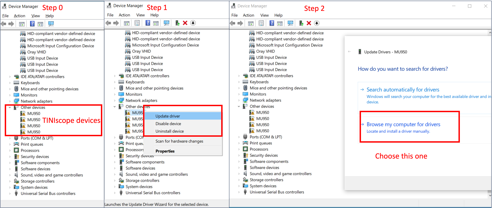
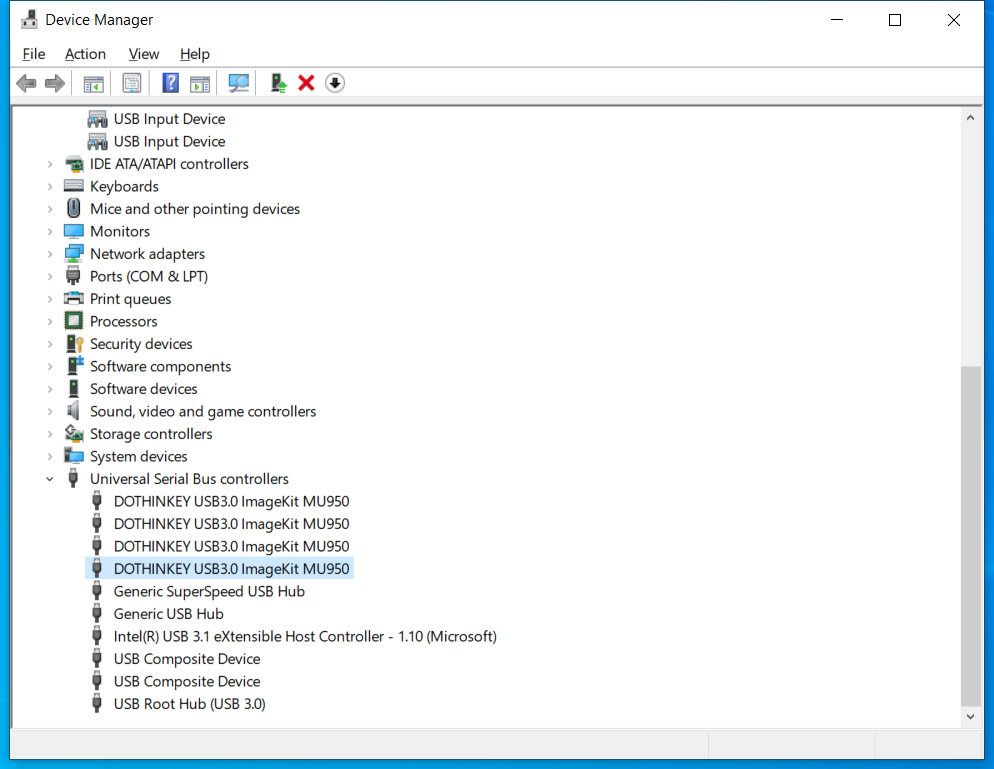
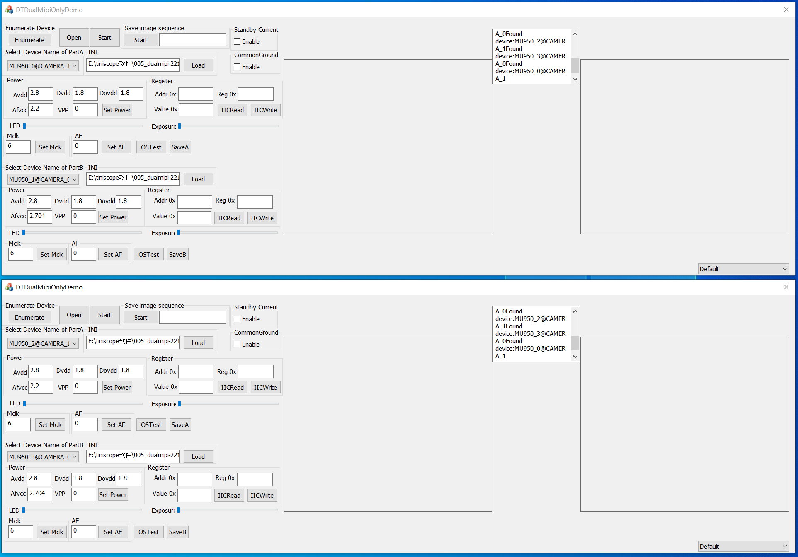
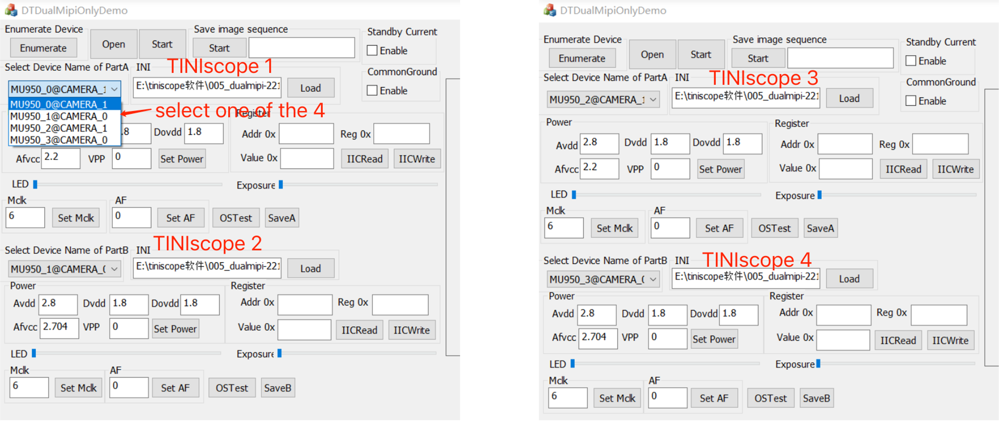
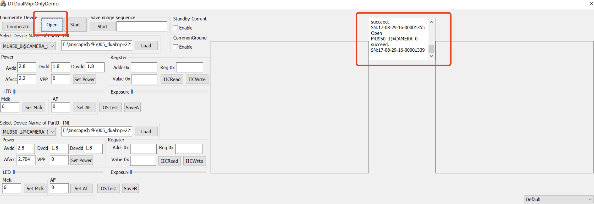
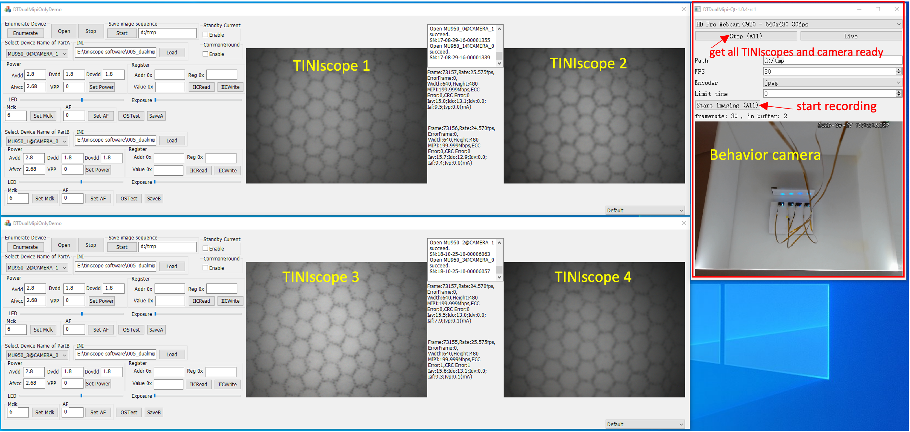

# Install GUI and driver 

TINIscope uses a serialized data transmission protocol (MIPI interface) to send CMOS signals to the data acquisition (DAQ) board. This protocol does not require a serializer chip on the head-mounted side, but it needs 10 wires in total for data transmission, SCCB hardware configurations and power supply. The DAQ board not only receives CMOS signals from the rigid-flex PCB but also provides the power and clock signals directly, allowing the removal of these modules from the head-mounted side. 

For connecting the DAQ boards to the computer, USB connections are used. We have also developed a GUI software that facilitates acquiring image data and configuring the CMOS image sensors exclusively through the HDI rigid-flex PCB. Additionally, our GUI enables synchronization of the behavior camera with TINIscope recording.

In this section, we will provide a detailed description of how to configure the software environment for recording with TINIscope.


## Requirements
* The computer's RAM should be a minimum of 64GB
  * Given the throughput of 4 TINIscope devices at approximately 2B x (640 × 480) x 40 Hz x 4 ~ 93.75 MB/second, it is necessary to have a large RAM for optimal performance. 
* Windows operating system
  * Our testing has been conducted on the Windows operating system exclusively. 
* Driver for TINIscope 
  * Download the [zip file](../TINIscope_Softwares/driver.zip)
  * uncompress driver.zip.
* GUI software 
  * Download the [zip file](../TINIscope_Softwares/GUI.zip)
  * uncompress GUI.zip.

## Driver for TINIscope
Each TINIscope requires a separate USB3.0 connection from the DAQ board to connect to an individual computer. If the driver is not installed, the device will be identified as unrecognized in the Windows Device Manager. The file structure of uncompressed `driver.zip` is like below: 
```plain 
USB3.0_Kit_driver
├── x64
│   ├── WdfCoInstaller01009.dll
│   ├── dtusb3.cat
│   ├── dtusb3.inf
│   ├── dtusb3.sys
│   ├── dtusb3x64.cat
│   └── dtusb3x64.sys
└── x86
    ├── WdfCoInstaller01009.dll
    ├── dtusb3.cat
    ├── dtusb3.inf
    └── dtusb3.sys
2 directories, 10 files
```

Here are steps for installing the driver: 



* step 0: open Device Manager in Windows and find the 4 unrecognized TINIscope devices, labelled as MU950. 
* step 1: right click one of them and choose **update driver**. 
* step 2: in the pop up window, choose **browse my computer for drivers**. 
* step 3: select either `x64` or `x86` folder according to your operating system in the uncompressed `USB3.0_Kit_driver` folder. 
* step 4: repeat the same operation for the other 3 decices. 

Congratulations to you if see the following:




## GUI 
These GUI software programs can be executed directly without requiring any installation.The file structure of the uncompressed `GUI.zip` is shown below: 
``` plain 
GUI
├── DTDualMipiOnlyDemo-1.1.4.exe
├── DTDualMipiOnlyDemo-1.1.4.*.         ## skipped files 
├── *.dll.                              ## skipped dll files 
├── OV6710_2L_400_063_20 - 副本.ini.     
├── OV7251_480_063_c0.ini
├── controller
│   ├── DTDualMipi-Qt-1.0.4-rc1.exe
│   ├── *.dll                           ## skipped dll files 
│   ├── plugins

2 directories, 50 files
```
Among these files, we mainly use 3 of them:
* `DTDualMipiOnlyDemo-1.1.4.exe`
* `OV7251_480_063_c0.ini`
* `controller/DTDualMipi-Qt-1.0.4-rc1.exe`

Essentially, the process involves two primary steps, which are outlined in the following sections.

### Configuring TINIscopes with DTDualMipiOnlyDemo-1.1.4.exe 

1. By double-clicking on `DTDualMipiOnlyDemo-1.1.4.exe` twice, two separate windows for TINIscope configuration will open simultaneously, as depicted below:
   
   
2. Each window manages two TINIscope devices, and it is necessary to manually select one device for each slot.

    

3. load configuration files by clicking the `Load` button and adjust the options. 
   The description of these options were shown in this table 
   |name | descriptions|
   |-----| ------------|
   |Avdd| power supply for CMOS, default: 2.8 | 
   |Dvdd| not used|
   |Dovdd| power supply for CMOS, default: 1.8|
   |Afvcc| |
   |VPP | |
   |Addr 0x| CMOS, 12C address; | 
   |Reg 0x| register address of CMOS; 0x3501 | 
   |Value 0x | |
   |Mclk| clock of CMOS|
   |AF | not used |
   || |

4. Verify the status of TINIscope configuration by clicking the button `Open` on the top panel. 

Congratulations to you if you see two `succeed` in one window.

### Synchroning calcium imaging and behavior recording with controller/DTDualMipi-Qt-1.0.4-rc1.exe


